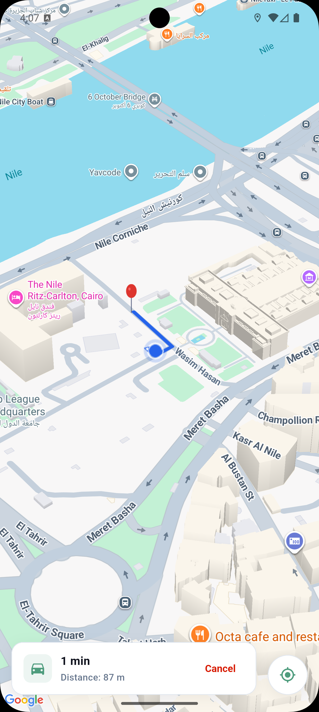
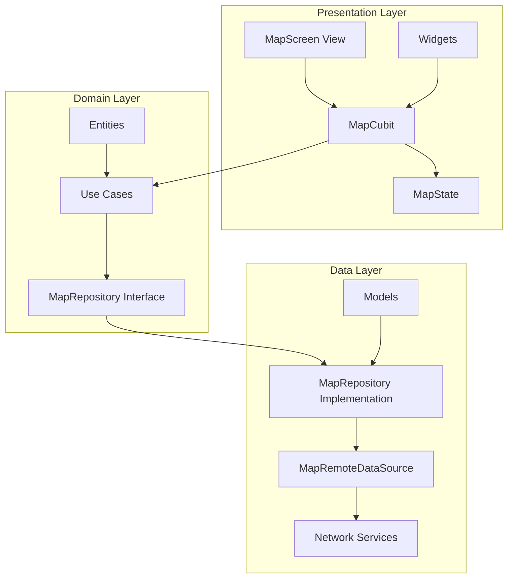

# 📍 Tareeq — Modern Route Finder & Navigator

Tareeq is a highly premium, modern Flutter application built with Clean Architecture, BLoC state management, and the Google Maps Platform. It delivers an elegant, high-fidelity navigation experience featuring real-time location streaming, smart session-grouped autocomplete search, instant direction routing, 3D building rendering, and smart arrival notification overlays.

---

## 📸 Screenshots

<p align="center">
  
  
</p>

---

## 🚀 Key Features

*   **Premium 3D Perspective Map**: Built with a sleek tilted viewpoint (`initialTilt: 90` to maximize device clipping) and high-fidelity rendering. 3D extruded solid building models are explicitly enabled for highly detailed urban context.
*   **Real-time GPS Tracking**: Extremely fluid location stream that dynamically updates user coordinate indicators (custom glowing circular direction indicator) and bearings, filtering out micro-vibrations and sensor jitter.
*   **Smart Destination Search**: Implements Google Places Autocomplete API with **Session Token grouping** to minimize API request billing charges.
*   **Dynamic Route Processing**: Fetches premium route polyline pathways dynamically using the Google Directions API and draws beautiful high-contrast routing paths over the map.
*   **Arrival Alert System**: Constantly calculates proximity using a high-precision distance-bearing algorithm, displaying a glassmorphic arrival card when within the arrival threshold.
*   **Automatic Keys Protection**: Integrates a custom **single source of truth secrets pipeline**. iOS and Android pre-compilers extract keys from a unified, gitignored `.env` file and generate native config files as well as runtime Dart secrets. **Works out of the box in VS Code, Android Studio, and terminal builds without custom launch arguments.**

---

## 🏗️ Architecture Design

Tareeq is strictly structured following **Clean Architecture** patterns segregated by domain features to guarantee scalability, clean test boundaries, and strict division of concerns:



*   **Presentation Layer**: `MapCubit` manages UI states (`MapLoaded`, `MapLoading`, `MapError`) and captures user actions, utilizing BLoC pattern for optimal performance.
*   **Domain Layer**: Pure business logic containing Use Cases (`GetDirectionsUseCase`, `GetCurrentLocationUseCase`, `GetLocationStreamUseCase`, etc.) and abstract contract interfaces.
*   **Data Layer**: Responsible for mapping data objects (`Models`), managing remote datasources (`MapRemoteDataSource`), and implementing repositories.

---

## 🛠️ Unified Secret Keys Pipeline (.env)

Tareeq hides and manages API keys in a single, gitignored `.env` file at the root. Our pre-compile automation propagates keys across all platforms automatically:

```
[ .env ] (Single source of truth)
   │
   ├───► (Gradle Pre-build) ──────► (Writes to) ─► [ lib/core/constants/app_secrets.dart ] ◄──┐
   ├───► (Xcode Build Phase) ─────► (Writes to) ─► [ ios/Flutter/Secrets.xcconfig ]         │
   └──────────────────────────────► (Writes to) ─► [ android/app/build.gradle.kts ]          │
                                                                                             │
                                                      (Dart Runtime loads key directly from ─┘
                                                       ignored/secure AppSecrets class)
```

### Setup Instructions

1.  **Configure API Key**:
    Clone the environment file template at the root of the project:
    ```bash
    cp .env.example .env
    ```
    Open the newly created `.env` file and insert your Google Maps API Key:
    ```ini
    GOOGLE_MAPS_API_KEY=AIzaSyYourActualAPIKeyHere...
    ```

2.  **Platform Pre-requisites**:
    *   **Android**: Ensure your `GOOGLE_MAPS_API_KEY` has **Maps SDK for Android**, **Places API**, and **Directions API** enabled inside the Google Cloud Console.
    *   **iOS**: Ensure your `GOOGLE_MAPS_API_KEY` has **Maps SDK for iOS**, **Places API**, and **Directions API** enabled inside the Google Cloud Console.

3.  **Run the Project**:
    Run standard flutter commands. The automation will automatically generate platform files and load the key into the app at runtime:
    ```bash
    flutter pub get
    flutter run
    ```

---

## 🛡️ Security & Git Best Practices

The following config and secret files contain sensitive keys and are **excluded from version control** (fully ignored in `.gitignore`):
*   `.env` — The local variables source file.
*   `ios/Flutter/Secrets.xcconfig` — Used by iOS native configuration.
*   `lib/core/constants/app_secrets.dart` — Dynamically updated Dart class containing secrets at compile time.

---

## ⚡ Tech Stack

*   **Core**: [Flutter](https://flutter.dev) (Dart SDK)
*   **State Management**: [flutter_bloc](https://pub.dev/packages/flutter_bloc)
*   **Service Locator**: [get_it](https://pub.dev/packages/get_it)
*   **Map Integration**: [google_maps_flutter](https://pub.dev/packages/google_maps_flutter)
*   **Sensor APIs**: [geolocator](https://pub.dev/packages/geolocator)
*   **Networking**: [http](https://pub.dev/packages/http)
*   **Animations**: [lottie](https://pub.dev/packages/lottie)
